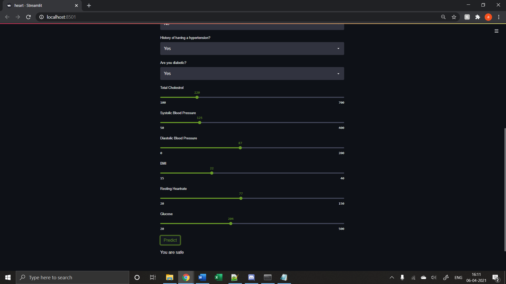

# DL-Project_Coronary-Heart-Disease-Predictor
A machine learning tool based on the Framingham Heart Disease Study    

The tool takes input as  
Gender  
Smoking Status  
Cigarettes per day  
Do you take Blood Pressure Medications  
History of stroke  
History of hypertension  
Are you Diabetic  
Total Cholestrol  
Systolic BP  
Diastolic BP  
Body Mass Index  
Resting heartRate  
Glucose  

## How to launch this?
``` 
1.cd to the drive where this repository is located.
2.pip install streamlit
3.streamlit run heart.py

```
## Results


<p align="left"></p>
<p align="left"></p>
<p align="left"></p>
<p align="left"></p>

